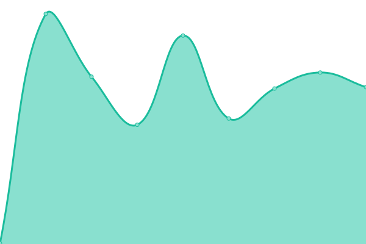
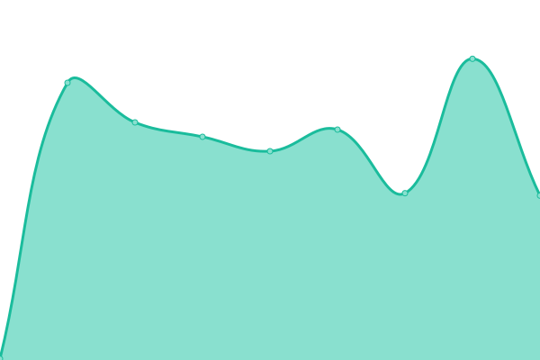

# [📈 Live Status](https://jeffery-mclaughlin.github.io/quiannaco): <!--live status--> **🟩 All systems operational**

This repository contains the open-source uptime monitor and status page for [jeffery-mclaughlin](https://jeffery-mclaughlin.github.io/quiannaco), powered by [Upptime](https://github.com/upptime/upptime).

With [Upptime](https://upptime.js.org), you can get your own unlimited and free uptime monitor and status page, powered entirely by a GitHub repository. We use [Issues](https://github.com/jeffery-mclaughlin/quiannaco/issues) as incident reports, [Actions](https://github.com/jeffery-mclaughlin/quiannaco/actions) as uptime monitors, and [Pages](https://jeffery-mclaughlin.github.io/quiannaco) for the status page.

<!--start: status pages-->
<!-- This summary is generated by Upptime (https://github.com/upptime/upptime) -->
<!-- Do not edit this manually, your changes will be overwritten -->
<!-- prettier-ignore -->
| URL | Status | History | Response Time | Uptime |
| --- | ------ | ------- | ------------- | ------ |
|  [quianna.co](https://quianna.co) | 🟩 Up | [quianna-co.yml](https://github.com/jeffery-mclaughlin/rivendell/commits/HEAD/history/quianna-co.yml) | 

 329ms
     
 | 

<a href="https://jeffery-mclaughlin.github.io/rivendell/history/quianna-co">100.00%</a>
    

|  [mgrid.ai](https://mgrid.ai) | 🟩 Up | [mgrid-ai.yml](https://github.com/jeffery-mclaughlin/rivendell/commits/HEAD/history/mgrid-ai.yml) | 

 280ms
     
 | 

<a href="https://jeffery-mclaughlin.github.io/rivendell/history/mgrid-ai">100.00%</a>
    

|  [jefferymac.com](https://jefferymac.com) | 🟩 Up | [jefferymac-com.yml](https://github.com/jeffery-mclaughlin/rivendell/commits/HEAD/history/jefferymac-com.yml) | 

 205ms
     
 | 

<a href="https://jeffery-mclaughlin.github.io/rivendell/history/jefferymac-com">100.00%</a>
    

<!--end: status pages-->

[**Visit our status website →**](https://jeffery-mclaughlin.github.io/quiannaco)

## 📄 License

- Powered by: [Upptime](https://github.com/upptime/upptime)
- Code: [MIT](./LICENSE) © [Anand Chowdhary](https://anandchowdhary.com), supported by [Pabio](https://pabio.com)
- Data in the `./history` directory: [Open Database License](https://opendatacommons.org/licenses/odbl/1-0/)
